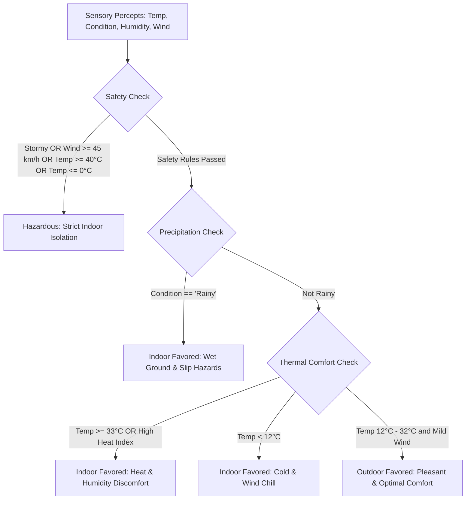

# 🌦️ Weather-Based Activity Agent

A beginner-friendly, clean, and interactive Artificial Intelligence project designed for **2nd-Year Computer Science & Engineering (AIML)** students.

The **Weather-Based Activity Agent** is a **Rational Agent** that perceives weather conditions through manual sensory inputs, evaluates physical safety and thermal comfort, and acts by recommending suitable indoor or outdoor activities along with transparent logical reasoning.

---

## 🎯 Project Objective

In Artificial Intelligence, an agent is anything that perceives its environment through sensors and acts upon that environment through actuators. A **Rational Agent** selects an action that is expected to maximize its performance measure, based on the evidence provided by its percept sequence and built-in domain knowledge.

This project demonstrates:
1. Formulating an AI problem using the **PEAS framework** (*Russell & Norvig, Artificial Intelligence: A Modern Approach*).
2. Implementing rule-based knowledge representation and rational inference in Python.
3. Providing **explainable AI (XAI)** by displaying the step-by-step reasoning behind every recommendation.
4. Connecting the AI agent to a clean, modern, and responsive web interface using Flask.

---

## 🧠 The PEAS Framework

| Element | Description in this Agent |
| :--- | :--- |
| **Performance Measure (P)** | Maximizes user safety, thermal comfort, physical feasibility, and recreational satisfaction. |
| **Environment (E)** | Meteorological atmospheric conditions (ambient temperature, sky condition, moisture/humidity, and wind speed). |
| **Actuators (A)** | Activity recommendations, outdoor vs. indoor classification verdict, safety warnings, and logical justification. |
| **Sensors (S)** | Sensory inputs collected via user interface: `Temperature (°C)`, `Weather Condition`, `Humidity (%)`, and `Wind Speed (km/h)`. |

---

## ⚙️ Decision Logic & Reasoning Engine

The agent evaluates weather percepts through a 3-tier hierarchical rule base:



1. **Safety Filter (Priority 1)**:
   - Severe weather (`Stormy`, wind $\ge 45\text{ km/h}$, extreme heat $\ge 40^\circ\text{C}$, or freezing $\le 0^\circ\text{C}$) triggers an immediate hazardous condition verdict. Rational agents prioritize human safety over recreation.
2. **Precipitation & Wetness Analysis (Priority 2)**:
   - Active rain creates slip hazards and makes outdoor sports impractical. Indoor recreational and fitness centers are favored.
3. **Thermal Comfort & Atmospheric Suitability (Priority 3)**:
   - When weather is safe and dry, the agent assesses temperature and humidity to recommend cycling, jogging, picnics, and sports (if pleasant) or AC cooling/warm meals (if too hot or chilly).

---

## 📁 Project Structure

```text
weather-based-activity-agent/
│
├── agent.py               # Core Rational Agent logic (PEAS, percept validation, reasoning rules)
├── app.py                 # Lightweight Flask web server and JSON API routes
├── test_agent.py          # Automated unit test suite verifying agent rationality
├── requirements.txt       # Python dependencies (Flask >= 3.0.0)
├── README.md              # Project documentation and guide
│
├── templates/
│   └── index.html         # Modern, responsive web user interface
│
└── static/
    ├── css/
    │   └── style.css      # Clean aesthetic, dark theme, and color-coded banners
    └── js/
        └── app.js         # Client-side script: async fetch, UI updates & preset buttons
```

---

## 🚀 Getting Started

### 1. Prerequisites
- Python 3.9 or higher (Tested on Python 3.14).
- **No external API keys are required**! The project runs entirely locally and self-contained.

### 2. Installation
Open your terminal (PowerShell, Command Prompt, or Bash) in the project directory:

```bash
# Optional: create a virtual environment
python -m venv venv

# Activate the virtual environment
# On Windows (PowerShell):
.\venv\Scripts\Activate.ps1
# On Windows (CMD):
.\venv\Scripts\activate.bat
# On macOS/Linux:
source venv/bin/activate

# Install dependencies
python -m pip install -r requirements.txt
```

### 3. Running the Application
Start the Flask web server:

```bash
python app.py
```

Once started, open your web browser and navigate to:
👉 **[http://127.0.0.1:5000/](http://127.0.0.1:5000/)**

---

## 🧪 Testing the Agent

### Automated Unit Tests
Run the comprehensive unit test suite:

```bash
python test_agent.py
```
*Expected output:*
```text
........
----------------------------------------------------------------------
Ran 8 tests in 0.001s

OK
```

### Manual Testing Scenarios via Web UI
You can use the **Quick Test Preset Buttons** at the top of the web UI or manually test the following scenarios:

| Scenario | Input Percepts | Expected Decision | Expected Reason |
| :--- | :--- | :--- | :--- |
| **Ideal Sunny Day** | 24°C, Sunny, 45% Humidity, 12 km/h Wind | **Outdoor Favored** (Pleasant & Comfortable) | Clear skies and ideal thermal comfort zone. Recommends cycling, jogging, park picnic. |
| **Overcast Afternoon** | 20°C, Cloudy, 55% Humidity, 15 km/h Wind | **Outdoor Favored** (Pleasant & Comfortable) | Natural cloud cover shields from harsh UV rays; ideal for walking and photography. |
| **Monsoon / Rainy Day** | 18°C, Rainy, 85% Humidity, 18 km/h Wind | **Indoor Favored** (Precipitation & Wet Ground) | Wet ground and precipitation; suggests indoor gym, museum, reading, or walk with umbrella. |
| **Severe Thunderstorm** | 27°C, Stormy, 92% Humidity, 38 km/h Wind | **Hazardous Weather** (Stay Indoors) | Lightning hazard and heavy downpour. All outdoor activities discouraged. |
| **Extreme Heatwave** | 41°C, Sunny, 30% Humidity, 8 km/h Wind | **Hazardous Weather** (Extreme Heat) | Risk of heatstroke and dehydration under $\ge 40^\circ\text{C}$ temperatures. |
| **Winter Chill** | 5°C, Cloudy, 60% Humidity, 25 km/h Wind | **Indoor Favored** (Cold & Chilly) | Low temperature and wind chill; indoor heating and warm cooking favored. |

---

## 💻 REST API Endpoint

The server exposes a JSON API endpoint for external integrations:

### `POST /api/recommend`
**Request Headers:** `Content-Type: application/json`

**Sample Request Body:**
```json
{
  "temperature": 24.5,
  "condition": "Sunny",
  "humidity": 50,
  "wind_speed": 12.0
}
```

**Sample Response:**
```json
{
  "success": true,
  "data": {
    "classification": "Outdoor Favored (Pleasant & Comfortable Weather)",
    "summary_badge": "Outdoor Recommended",
    "verdict_color": "success",
    "explanation": "Clear sunny skies and moderate temperature (24.5°C) make conditions ideal for outdoor fitness...",
    "reasons": [
      "🌤️ Condition is Sunny with a pleasant temperature of 24.5°C.",
      "🌿 Perfect thermal comfort zone with moderate humidity (50.0%)."
    ],
    "primary_activities": [
      {"name": "Cycling / Biking", "icon": "🚲", "desc": "Great aerobic exercise under pleasant weather."},
      {"name": "Jogging or Running", "icon": "🏃", "desc": "Keep fit with an outdoor run in fresh air."}
    ],
    "indoor_suggestions": [...],
    "outdoor_suggestions": [...]
  }
}
```

---

## 🎓 Academic Value (Why this is great for CSE-AIML)

1. **Directly addresses AI Syllabus Concepts**: Implements rational agent behavior without unnecessary black-box complexity.
2. **Explainable AI (XAI)**: Rather than merely providing an output, the agent exposes its sensory rule trace and causal reasoning.
3. **Modular and Extensible**: Students can easily add more percepts (e.g., UV Index, Air Quality Index / AQI) or extend the activity knowledge base in `agent.py`.
4. **No Hidden Costs or Dependencies**: Completely free, runnable offline, and beginner-friendly.
